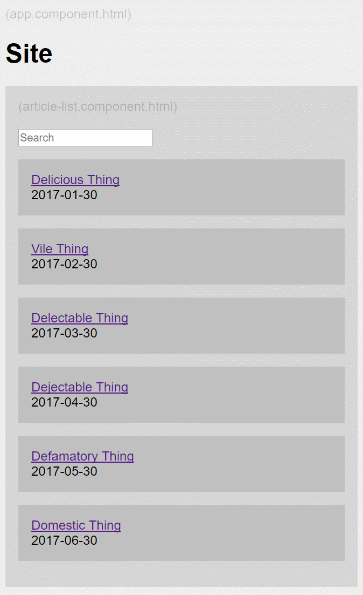

# Angular2 Flat Blog Test Project

(Check it out!)[https://entozoon.github.io/angular2-flat-blog-boilerplate/]

Just tinkering around with angular-cli and webpack, rather than a boilerplate.
For now, at least.

## Develop

    npm start

## Deploying

Build and deploy (which uses
[angular-cli-ghpages](https://github.com/angular-buch/angular-cli-ghpages)),
(NOTE: This'll be different for your project - look in `package.json`):

    npm run deploy

NOTE: It takes a couple minutes, for github to (automatically) update its live
server with your branch. Have a look at the
[branch commits page](https://github.com/entozoon/angular2-flat-blog-boilerplate/commits/gh-pages)
and see if the commit is 'pending' (circle) or 'successful' (tick).

## NOTES

How to create a blank Angular project from scratch with SCSS compilation:

    ng new projectName --style=scss
